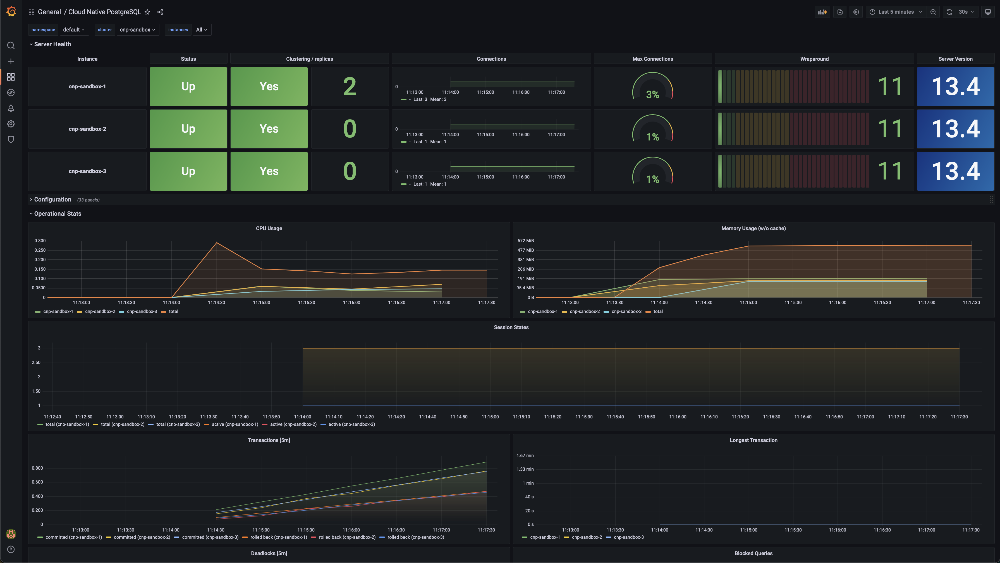

# CloudNativePG Helm Chart

Helm chart to install the
[CloudNativePG operator](https://cloudnative-pg.io),originally created and sponsored by 
[EDB](https://www.enterprisedb.com/) to manage PostgreSQL workloads on any supported Kubernetes cluster
running in private, public, or hybrid cloud environments.

## Deployment using the latest release

```console
helm repo add cnpg https://cloudnative-pg.github.io/charts
helm upgrade --install cnpg \
  --namespace cnpg-system \
  --create-namespace \
  cnpg/cloudnative-pg
```

## Deployment using local chart

To deploy the operator from sources you can run the following command:

```console
helm upgrade --install cnpg \
  --namespace cnpg-system \
  --create-namespace \
  charts/cloudnative-pg
```

# Sandbox for CloudNativePG

CloudNativePG Sandbox, aka `cnpg-sandbox`, is a Helm chart that
sets up the following components inside a Kubernetes cluster:

- [Prometheus](https://prometheus.io/)
- [Grafana](https://github.com/grafana/grafana)
- [CloudNativePG (CNPG)](https://cloudnative-pg.io) a Kubernetes operator for [PostgreSQL](https://www.postgresql.org/), with:
    - a selection of PostgreSQL metrics for the native Prometheus exporter in CNPG (see the [`metrics.yaml`](charts/cnpg-sandbox/templates/metrics.yaml) template file)
    - a [custom Grafana dashboard](charts/cnpg-sandbox/dashboard.json) for CloudNativePG

**IMPORTANT:** `cnpg-sandbox` must be run in a staging or pre-production
environment. Do not use `cnpg-sandbox` in a production environment, as we
expect that Prometheus and Grafana are already part of that infrastructure:
there you can install CloudNativePG, the suggested metrics and the
provided Grafana dashboard.



## Requirements

- CloudNativePG 1.10.0
- [GNU Make](https://www.gnu.org/software/make/) 3.8
- [Helm](https://helm.sh/) 3.7
- A supported Kubernetes cluster with enough RBAC permissions to deploy the required resources

## Deployment

Deployment using the latest release:

```console
helm repo add cnpg https://cloudnative-pg.github.io/charts
helm repo update
helm upgrade --install cnpg-sandbox \
  cnpg/cnpg-sandbox
```

Then simply follow the instructions that will appear on the terminal once the
installation is completed.

#### Deployment from local source

You can deploy CloudNativePG Sandbox from local source with:

```console
make sandbox-deploy
```

You can remove the installed sandbox by running:

```console
make sandbox-uninstall
```

## Monitoring

From the Grafana interface, you can find the dashboard by selecting: `Dashboards` > `Manage` > `CloudNativePg`.

## Benchmarking the database with `pgbench`

[pgbench](https://www.postgresql.org/docs/current/pgbench.html) is the default
benchmarking application for PostgreSQL. The chart for `pgbench` is contained
in the `cnpg-pgbench` directory.

## Deployment

Deployment using the latest release:

```console
helm repo add cnpg https://cloudnative-pg.github.io/charts
helm repo update
helm upgrade --install cnpg-pgbench \
  --namespace cnpg-pgbench-ns \
  --create-namespace \
  charts/cnpg-pgbench
```

Then simply follow the instructions that will appear on the terminal once the
installation is completed.

#### Deployment from local source

To deploy the operator from sources you can run the following command:

```console
helm upgrade --install cnpg-pgbench \
  --namespace cnpg-pgbench-ns \
  --create-namespace \
  charts/cnpg-pgbench
```


You can run a `pgbench` benchmark on:

- a disposable PostgreSQL cluster created by the CNP operator specifically for
  the benchmark
- an existing PostgreSQL cluster, by providing connection information (host,
  port, database name, and user)

The `cnp.existingCluster` option is the one that controls the above behavior.

While running a job on a cluster that lives for the sole duration of the test
is useful, we recommend that you first create your PostgreSQL cluster, possibly
with `cnpg-sandbox` installed, and then run `pgbench` on that cluster as explained
in the "Running `pgbench` on an existing Postgres cluster" section below.

### Running `pgbench` on a disposable CNP cluster

When `cnp.existingCluster` is set to `false` (default), the chart will:

1. Create a CNP cluster based on the user-defined values;
1. Execute a user-defined `pgbench` job on it.

You can use the `kubectl wait` command to wait until the job is complete:

``` sh
kubectl wait --for=condition=complete -n cnpg-pgbench-ns job/cnpg-pgbench
```

It is suggested to label nodes and use node selectors to avoid pgbench and
PostgreSQL pods running on the same node. By default, the chart expects
the nodes on which pgbench can run to be labelled with `workload: pgbench`
and the node for CNP instances to be labelled with `workload: postgres`.

``` sh
kubectl label node/NODE_NAME workload:pgbench
kubectl label node/OTHER_NODE_NAME workload:postgres
```

You can gather the results after the job is completed running:

``` sh
kubectl logs -n cnpg-pgbench-ns job/cnpg-pgbench
```

Below is an example of pgbench output:

```console
starting vacuum...end.
transaction type: <builtin: TPC-B (sort of)>
scaling factor: 1
query mode: simple
number of clients: 1
number of threads: 1
duration: 30 s
number of transactions actually processed: 16964
latency average = 1.768 ms
initial connection time = 9.924 ms
tps = 565.639903 (without initial connection time)
```

#### Adding a connection pooler

CNP has native support for the PgBouncer pooler. You can create a database
access layer with PgBouncer by managing the `cnp.pooler` section of the values
file. By default, PgBouncer will be placed on those nodes with the `workload:
pooler` label.

Look at the `cnpg-pgbench/values.yaml` for an example, as well as the CNP
documentation for more information on the PgBouncer implementation.

### Running `pgbench` on an existing Postgres cluster

Suppose you already have your PostgreSQL database setup (not necessarily with CNP).
You can use `cnpg-pgbench` to run a `pgbench` test.


``` yaml
cnp:
  existingCluster: true
  # Name of the host (or service in K8s) or IP address where Postgres is running
  existingHost: mydb
  # You need to point `existingCredentials` to a Kubernetes `basic-auth`secret
  # containing username and password to connect to the database
  existingCredentials: mydb-app
  # Name of the database on which to run pgbench
  existingDatabase: pgbench

pgbench:
  # Node where to run pgbench
  nodeSelector:
    workload: pgbench
  initialize: true
  scaleFactor: 1
  time: 30
  clients: 1
  jobs: 1
  skipVacuum: false
  reportLatencies: false
```

The `cnp` section above, points to the existing database.

The `pgbench` section contains the parameters you can use to run the `pgbench` job.
For example, you can create a job that initializes only the `pgbench` database
for a given scale with different settings of clients, time and jobs.

## Contributing

Please read the [code of conduct](CODE-OF-CONDUCT.md) and the
[guidelines](CONTRIBUTING.md) to contribute to the project.

## Disclaimer

`cnpg-sandbox`is open source software and comes "as is". Please carefully
read the [license](LICENSE) before you use this software, in particular
the "Disclaimer of Warranty" and "Limitation of Liability" items.

## Copyright

`cnpg-sandbox` is distributed under Apache License 2.0.
`cnpg` is distributed under Apache License 2.0.
`cnpg-pgbench` is distributed under Apache License 2.0.
